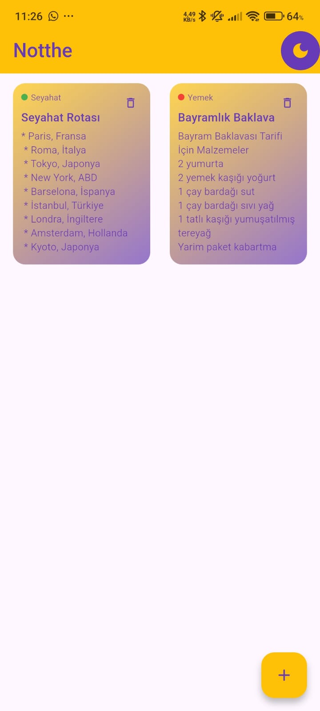
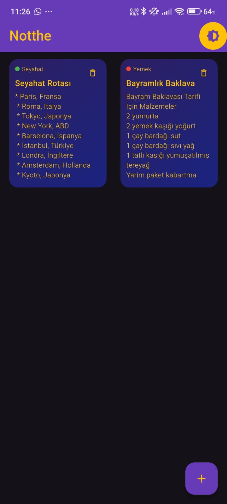
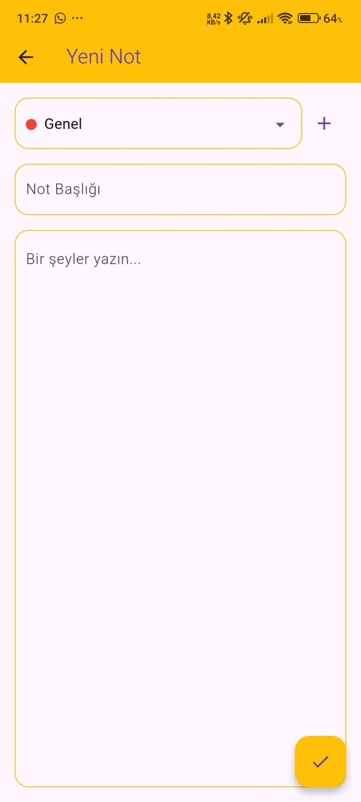
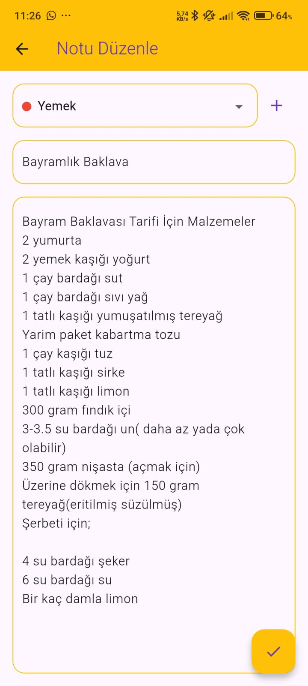
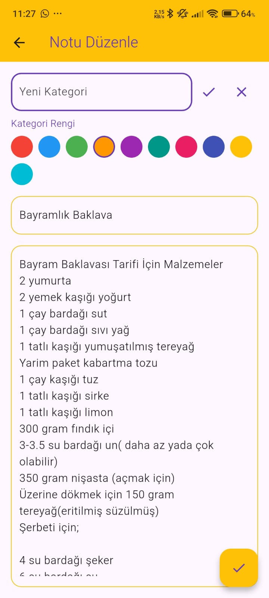

# Notthe - Not Alma Uygulaması

## Genel Bakış
Notthe, Flutter ile geliştirilmiş modern ve kullanıcı dostu bir not alma uygulamasıdır. Kategorilere göre notları düzenleme ve kolay erişim imkanı sunar.

## Özellikler
- **Kategori Sistemi**: Notları kategorilere ayırarak düzenleme
- **Özelleştirilebilir Kategori Renkleri**: Her kategori için özel renk seçimi
- **Kolay Kullanım**: Basit ve sezgisel kullanıcı arayüzü
- **Karanlık/Aydınlık Tema**: Göz yorgunluğunu azaltmak için tema desteği
- **Yerel Depolama**: SQLite veritabanı ile notların kalıcı olarak saklanması

## Teknik Özellikler
- **Framework**: Flutter
- **Veritabanı**: SQLite (sqflite)
- **Durum Yönetimi**: GetX
- **Mimari**: MVC (Model-View-Controller)

## Kullanım Kılavuzu

### Not Ekleme
1. Ana ekrandaki '+' butonuna tıklayın
2. Kategori seçin veya yeni kategori oluşturun
3. Not başlığı ve içeriğini girin
4. Kaydet butonuna tıklayın

### Kategori Yönetimi
1. Not eklerken veya düzenlerken 'Kategori' alanını seçin
2. Yeni kategori eklemek için '+' butonuna tıklayın
3. Kategori adını girin ve renk seçin
4. Onaylayın

### Not Düzenleme
1. Düzenlemek istediğiniz nota tıklayın
2. Gerekli değişiklikleri yapın
3. Kaydet butonuna tıklayın

### Not Silme
- Notu silmek için sağ üst köşedeki çöp kutusu ikonuna tıklayın

## Veritabanı Yapısı
Notlar aşağıdaki bilgileri içerir:
- ID (Otomatik)
- Başlık
- İçerik
- Kategori
- Kategori Rengi
- Oluşturulma Tarihi

## Geliştirici Notları
- Minimum Android API Seviyesi: 21 (Android 5.0)
- Flutter Sürümü: 3.x
- GetX Sürümü: 4.x
- SQLite Sürümü: 2.x

## Ekran Görüntüleri

### Ana Ekran

## Karanlık Tema

### Not Ekleme/Düzenleme

## Karanlık Tema

### Kategori Yönetimi

